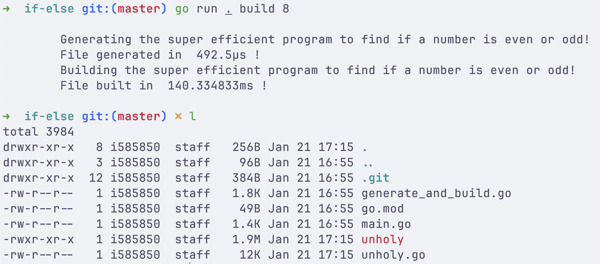

# a *super efficient program* to find if a number is even or odd

## inspiration

The inspiration for this program was
[this](https://andreasjhkarlsson.github.io//jekyll/update/2023/12/27/4-billion-if-statements.html) blog post
by GitHub user [@andreasjhkarlsson](https://github.com/andreasjhkarlsson).

## language

Since @andreasjhkarlsson used C, and Python for their experiment, I decided to stick to the language
I'm most comfortable with - Go.

## structure

The program accepts two commands `generate` and `build`.

- `generate` generates `unholy.go` which is file that has the implementation for finding if a number is even or odd.

- `build` generates `unholy.go` and builds the binary for `unholy.go`.

Both `generate` and `build` take one subcommand, which is the bit-size for the integer that is expected as input.
The permitted input sizes for the bit-size are `8`, `16`, and `32`. This subcommand controls the number of if-else
statements that are generated.

The program also profiles the time taken to generate the `unholy.go` file, and the time taken to build `unholy.go`.
These stats are printed to stdout.

## stats

The program crashed while running the program for 32-bit numbers on my Linux setup since my disk size was not large
enough to write the entire generated `unholy.go` file to disk; so for the sake of consistency: the following stats are
from running the program on an ARM based MacBook.

- For `./unholy build 8`: The program averaged around *350 microseconds* to generate `unholy.go` and *140 milliseconds*
to build it. The generated `unholy.go` file is *12KB* and the built binary is *1.9M*.

- For `./unholy build 16`: The program averaged around *50 milliseconds* to generate `unholy.go` and
*7 minutes 50 seconds* to build it. The generated `unholy.go` file is *3.1MB* and the built binary is *6.3MB*.

- For `./unholy build 32`: The program (ran it only once) took *1 hour 14 minutes 40 seconds* to generate `unholy.go`
and the program never built - the `Go` compiler refused to build such a large file. The generated `unholy.go` file is
*221GB* and the compiler fails to build with the error: `runtime: goroutine stack exceeds 1000000000-byte limit`. Since
the entire source can not be loaded into memory for the compiler to build it, the build fails.

